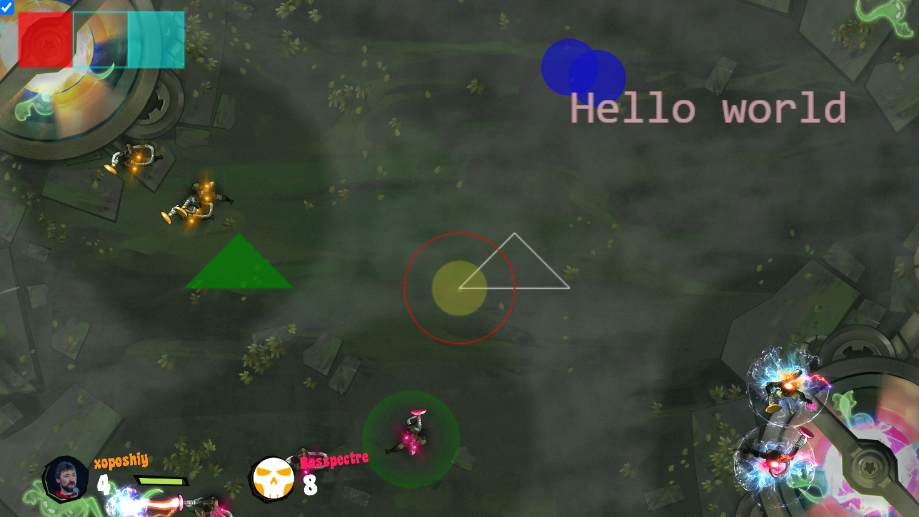

# CG Overlays Chrome Extension

# What is CG Overlays?
It adds overlays to the Codingame IDE to help you solve their programming challenges.


## How to use?

1. Your bot `print to stderr` special instructions.
2. Extension parses them and `draw` them over standard game visualizer.

Each instruction should be on a separate line and have the following format: 
```
@[instructionName] [instructionArgs]

or

![instructionName] [instructionArgs]
```

Instruction marked with ! will be executed every frame starting from the frame it was issued.

The following instructions are supported (all @-instructions can be used as !-instructions):

#### Rectangles

- `@r [color] [left] [top] [right] [bottom]` draws a rectangle without fill.
- `@fr ...` draws filled rectangle.
- `@tr ...` draws a rectangle with semitransparent fill.

#### Circles

- `@c [color] [x] [y] [radius]` draws a circle without fill.
- `@fc ...` draws a filled circle.
- `@tc ...` draws a circle with semitransparent fill.

#### Line paths

- `@l [color] [x1] [y1] [x2] [y2] ...` draws a lines path.
- `@fl ...` draws a lines path and fill internals.
- `@tl ...` draws a lines path and fill internals with semitransparent.

#### Grids

- `!grid [gridId] [nRows] [nCols] [left] [top] [cellWidth] [cellHeight]` - define grid, draws nothing.
- `@fgrid [color] [gridId] [cell1] [cell2] ...` - fill grid cells with numbers cell1, cell2, ... Cell (x, y) has number x + nCols*y.
- `@fcell [color] [gridId] [col] [row]` - fill grid cell with specified coordinates in the grid.

#### Text
- `@txt [color] [left] [bottom] [fontSize] [text]` draws a text. Font size is for 800px width canvas, for other canvas sizes font will be rescaled.
- `@font [font-name]` sets font for @txt.

#### GameParameters
For some [known games](extension/knownGames.js) you do not need these instructions. But if something is not working - use them!

- `!game [gameName]` sets game name. Some known games can't be detected by extension. You should help it to recognize game with this instruction (OceanOfCode, GameOfDrones, ...).
- `!stepEveryFrame` may be needed for some games. In some turn based games visualizer steps on every frame, not only on keyframes. So you need this instruction to sync steps in visualizer.
- `!vp [logicalFieldWidth] [screenFieldTop] [screenFieldRight] [screenFieldBottom]` sets the viewport. See below.
- `!o [opacity]` sets global opacity (in range 0 .. 1.0) for overlay canvas.

### How to use vp instruction?

`!vp [logicalFieldWidth] [screenFieldTop] [screenFieldRight] [screenFieldBottom]`

`logicalFieldWidth` - logical width of the field in game units, as specified in the statements.

All other three parameters — screen coordinates of the field rectangle if total screen width is resized to 16000.
To find this coordinates you can click on the visualizer, hold CTRL-key and move mouse pointer to the field corners.
You will see coordinates in the top-left corner of the visualizer.

For example, for OceanOfCode you can use `!vp 900 4270 770 11730` instruction:

- 15x15 cells field will be 900x900 logical units (60 units per cell).
- In the top-left corner of the field `4270 770` will be shown.
- In the top-right corner of the field `4270 11730` will be shown.

### Coordinates 

All other coordinates are logical coordinates, as in the game rules.

### Colors

Color can be specified in CSS color format (but no spaces please!). Some examples:
`#FF0000`, `rgb(0,255,255)`, `rgba(0,0,0,0.5)`, `red`.

Wrong color format will not be reported, but will be ignored.

## Errors checking

Syntax errors will be reported on the BSOD :)

### Sample stderr output

```
!game CodeBusters
@o 0.7
@fr red 0 0 1000 1000
@r #00FFFF 1000 0 2000 1000
@tr rgb(0,255,255) 2000 0 3000 1000
@l white 8000 5000 10000 5000 9000 4000 8000 5000
@fl green 3000 5000 5000 5000 4000 4000 3000 5000
@c red 8000 5000 1000
@fc rgba(255,255,0,0.3) 8000 5000 500
@tc blue 10000 1000 500
@tc blue 10500 1200 500
@font monospace
@txt pink 10000 2000 40 Hello world
```

Result:



## Synchronize overlay with visualized state

At the end of the game step visualizer shows _the result of the applied move_.
But overlay by default shows the stderr _on the beginning_ of the step. 
So the overlay is synchronized with the console output but not with the visual.

You can change this behavior by checkbox if you click on the extension icon.

## Constraints
It works on game replay page, and IDE page. Refresh page if it is not working.

Stderr is available for your own bots only. That's why no overlays for other players' bots.

Some games may not work properly because the wrong viewport. You can set it manually with `@vp` instruction. But would be better to make a pull-request with proper changes in [knownGames.js](https://github.com/xoposhiy/cg-overlays/blob/main/extension/knownGames.js).

## Turning off
Small checkbox in top-left corder of visualizer will disable overlays.

Also you can disable extension.

## How to install extension

### From Chrome Web Store

coming soon...

### From sources

1. Clone / Download this repo
2. Open `Manage extensions` in Chrome.
3. Turn on developer mode.
4. Click `Load Unpacked` and select `extension` directory from this repository.
Done!

Open Codingame IDE, add some instructions to stderr and test. Refresh the page if something is not working.

## Contribute

To convert in-game coordinates to physical, we need the conversion rules.
Please, make pull requests with these rules for other games to [extension/knownGames.js](extension/knownGames.js).

Also, you can contribute more instructions to draw graphical primitives in file [extension/drawer.js](extension/drawer.js).

## TODO

* Add some other graphical primitives (arrows, grid, hexagonal-grid, triangles, flags, circle sectors, ...)
* Add popup support
* Handle resize window event


## Thanks for icon

[Overlay icons created by Freepik - Flaticon](https://www.flaticon.com/free-icons/overlay)