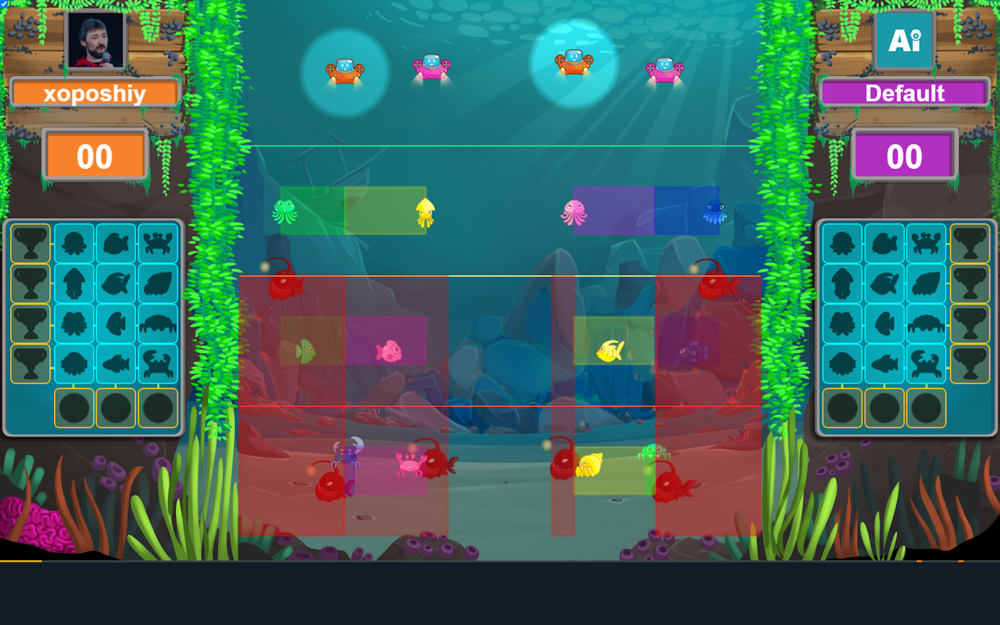
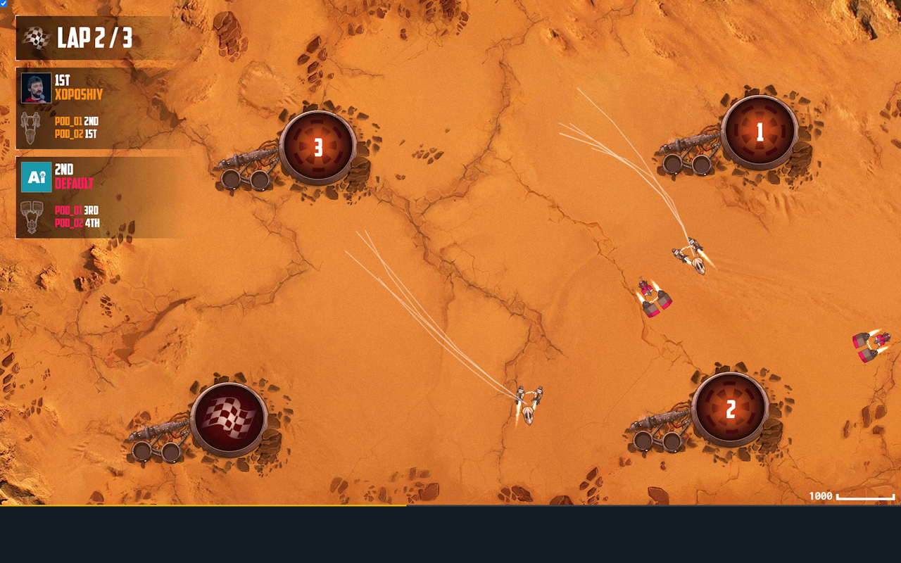

# CG Overlays Chrome Extension

# What is CG Overlays?
It adds overlays to the Codingame IDE to help you solve their programming challenges.

## Screenshots

## How to use?
You bot should output to stderr special instructions, which will be interpreted by the extension, and the overlay will be added to the game visualizer.

Each instruction should be on a separate line and have the following format: `@[InstructionName] [args]`

The following instructions are supported:
- `@vp [left] [top] [right] [bottom]` - sets the viewport. Specify logical coordinates for left-top and right-bottom corners of visualizer screen. You don't need it for [known games](extension/knownGames.js).
- `@r [left] [top] [right] [bottom] [color]` - draws rectangle
- `@fr [left] [top] [right] [bottom] [color]` - draws filled rectangle
- `@tr [left] [top] [right] [bottom] [color]` - draws rectangle with semitransparent fill
- `@c [x] [y] [radius] [color]` - draws a circle
- `@fc [x] [y] [radius] [color]` - draws a filled circle
- `@tc [x] [y] [radius] [color]` - draws a circle with semitransparent fill
- `@l [color] [x1] [y1] [x2] [y2] ...` - draws a lines path
- `@txt [left] [bottom] [color] [fontSize] [text]` - draws a text Font size is for 800px width canvas, for other sizes font will be rescaled
- `@font [font-name]` - sets font for @txt.
- `@clr` - clears all overlays
- `@o [opacity]` - sets global opacity (in range 0 .. 1.0) for overlay canvas

All coordinates are logical coordinates, as in the game rules.

Color can be specified in CSS color format (but no spaces please!). Some examples:
`#FF0000`, `rgb(0,255,255)`, `rgba(0,0,0,0.5)`, `red`.

Wrong color format will not be reported, but will be ignored.

## Constrains
It works on game replay page, and IDE page.

Stderr is available for your own bots only. That's why no overlays for other players' bots.

Some games may not work properly because the wrong viewport. You can set it manually with `@vp` instruction. But would be better to make a pull-request with proper changes in [knownGames.js](https://github.com/xoposhiy/cg-overlays/blob/main/extension/knownGames.js).

## Turning off
Small checkbox in top-left corder of visualizer will disable overlays.

You bot should output to stderr special instructions, which will be interpreted by the extension,
and the overlay will be added to the game visualizer.

## How to install extension

### From Chrome Web Store
coming soon...

### From sources

1. Clone / Download this repo
2. Open `Manage extensions` in Chrome.
3. Turn on developer mode.
4. Click `Load Unpacked` and select `extension` directory from this repository.
Done!

Open Codingame IDE, add some instructions to stderr and test.

Refresh the page if something is not working.

## Contribute

To convert in-game coordinates to physical, we need the conversion rules.
Please, make pull requests with these rules for other games to [extension/knownGames.js](extension/knownGames.js).

## TODO

* On the last micro-frame of the frame show the next frame overlay to decrease confusion during debugging.
* Add instruction to draw trajectory of entities.  
* Add some other graphical primitives (arrows, triangles, flags, ...)
* Add popup support
* Handle resize window event

## Thanks for icon

[Overlay icons created by Freepik - Flaticon](https://www.flaticon.com/free-icons/overlay)